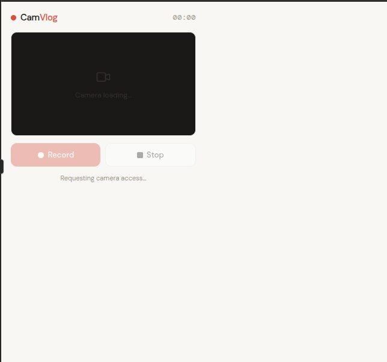
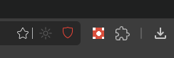

# CamVlog

A minimal Chrome extension to record your webcam directly from the browser — no software install required.

---

## Features

- Record webcam + audio in one click
- Live camera preview with mirror effect
- REC badge + timer while recording
- Auto-named file with timestamp (`camvlog-2026-03-09T10-30-00.webm`)
- Shows file size and duration before saving
- Saves as `.webm` to your Downloads folder

## Installation

This extension is not on the Chrome Web Store yet. Load it manually:

1. Download or clone this repo
2. Open Chrome and go to `chrome://extensions`
3. Enable **Developer mode** (toggle in the top right)
4. Click **Load unpacked** and select the `camvlog` folder
5. Click the CamVlog icon in your toolbar — it opens a new tab
6. Allow camera access when prompted

## Usage

1. Click **Record** to start recording
2. Click **Stop** when done
3. Click **Save** to download the `.webm` file

## Tech

- Manifest V3 Chrome Extension
- `MediaRecorder` API for recording
- `getUserMedia` for camera + audio access
- No frameworks, no dependencies

## License

MIT